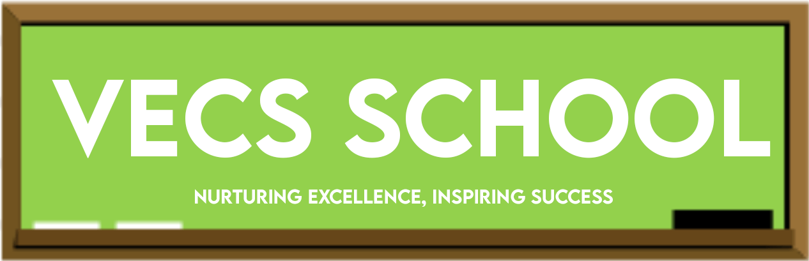

<a name="readme-top"></a>

<div align="center">
  
  <br/>

  <!-- <h3><b>VECS SCHOOL</b></h3> -->

</div>

<!-- TABLE OF CONTENTS -->
<details>
<summary> 📗 Table of Contents</summary>

- [📖 About the Project](#about-project)
  - [🛠 Built With](#built-with)
    - [Tech Stack](#tech-stack)
    - [Key Features](#key-features)
  - [🚀 Link to Live Demo](#live)
  - [🚀 Link to VECS School API](#live-demo)
  - [🚀 Link to VECS School Kanban Board](#kanban)
- [💻 Getting Started](#getting-started)
  - [Setup](#setup)
  - [Prerequisites](#prerequisites)
  - [Install](#install)
  - [Usage](#usage)
- [👥 Team](#team)
- [👥 Authors](#authors)
- [🔭 Future Features](#future-features)
- [🤝 Contributing](#contributing)
- [⭐️ Show your support](#support)
- [🙏 Acknowledgements](#acknowledgements)
<!-- - [❓ FAQ (OPTIONAL)](#faq) -->
- [📝 License](#license)
</details>
<!-- PROJECT DESCRIPTION -->

# 📚💻🌐 VECS SCHOOL FRONTEND <a name="about-project"></a>

Welcome to the frontend repository of VECS School's course booking platform. This repository hosts the user interface components and interactions that enable users to effortlessly browse courses, select preferred cities and dates, and make course bookings with price. The frontend is designed to seamlessly communicate with the backend API, providing a smooth and intuitive booking experience..

## 🛠 Built With <a name="built-with"></a>

### Tech Stack <a name="tech-stack"></a>

<details>
  <summary>Client</summary>
  <ul>
    <li>Library: <a href="https://react.dev/">React</a></li>
    <li>State management: <a href="https://redux.js.org/">Redux</a></li>
    <li>Styling: CSS</li>
  </ul>
</details>

<details>
  <summary>Backend</summary>
  <ul>
    <li>API Integration: <a href="https://github.com/christianonoh/vecs-school-backend/">VECS School API</a></li>
  </ul>
</details>

<details>
  <summary>Utils</summary>
  <ul>
    <li>Testing Framework: <a href="https://jestjs.io/">Jest</a></li>
    <li>Package Manager: Node Package Manager(npm)</li>
  </ul>
</details>

<!-- Features -->

### Key Features <a name="key-features"></a>

- **Course Exploration:** Users can explore available courses, view details, and learn about instructors and course content.

- **Booking Flow:** A user-friendly booking process guides users through selecting courses and dates, providing clear instructions and feedback.

- **Responsive Design:** The frontend is optimized for various devices, ensuring a consistent experience across desktops, tablets, and smartphones.

- **Visual Feedback:** Users receive visual cues for successful bookings, errors, and important actions, enhancing user confidence.

<p align="right">(<a href="#readme-top">back to top</a>)</p>

<!-- LIVE DEMO -->

## 🚀 Live Demo<a name="live"></a>

- Check out VECS SCHOOL app [here.](https://vecs-school.onrender.com)

<p align="right">(<a href="#readme-top">back to top</a>)</p>

## 🚀 Link to API<a name="live-demo"></a>

- Check out VECS SCHOOL API app [here.](https://github.com/christianonoh/vecs-school-backend/)

<p align="right">(<a href="#readme-top">back to top</a>)</p> 

<!-- KANBAN BOARD -->

## 🚀 Link to Kanban Board <a name="kanban"></a>

- Check out our kanban board [here.](https://github.com/users/christianonoh/projects/6/views/1)

- Check out our initial kanban board <a href='./src/assets/kanban0.png'>Here</a>

<p align="right">(<a href="#readme-top">back to top</a>)</p>

<!-- GETTING STARTED -->

## 💻 Getting Started <a name="getting-started"></a>

To get a local copy up and running, follow these steps.

### Prerequisites

Before you begin, make sure you have the following prerequisites:
- A modern web browser such as Google Chrome or Mozilla Firefox..
- An internet connection.
- The latest version of VECS School project.
### Setup

Clone or download the VECS School repository to your local machine.
```sh
  git clone https://github.com/smunoz1988/vecs-school-frontend.git
```
Open your terminal and navigate to the cloned project directory.
```sh
  cd vecs-school-frontend
```

### Install

Install the project dependencies by running the command:
```sh
npm install
```

### Usage
Run the following command to build the project:
```sh
npm run build
```

Start the localhost server to run the application locally.
```sh
  npm run dev
```
Open your web browser and go to `http://localhost:5173` and the application will be running.

## 🚀 Team members<a name="team"></a>

- Final number of team members: 4. Details on [Authors](#authors)

## 👥 Authors <a name="authors"></a>

👤 **Vanessa Oliveros Padron**

- GitHub: [@vvoo21](https://github.com/vvoo21)
- Twitter: [@vaneoliverosp](https://twitter.com/vaneoliverosp)
- LinkedIn: [vaneoliverosp](https://www.linkedin.com/in/vaneoliverosp/)

👤 **Santiago Munoz**

- GitHub: [@smunoz](https://github.com/smunoz1988)
- Twitter: [@twitterhandle](https://twitter.com/Santiag24209785)
- LinkedIn: [LinkedIn](https://www.linkedin.com/in/santiago-munoz-0b2b1a260)

👤 **Christian Onoh**

- GitHub: [@christianonoh](https://github.com/christianonoh)
- Twitter: [@onohchristian](https://twitter.com/onohchristian)
- LinkedIn: [Christian Onoh](https://www.linkedin.com/in/christianonoh)

👤 **Vitoesi Elijah**
- GitHub: [@Ellyboi](https://github.com/Ellyboi)
- Twitter: [@elijahvitoesi](https://twitter.com/elijahvitoesi)
- LinkedIn: [@Elijah](https://www.linkedin.com/in/vitoesi-elijah-61961611a/)

<p align="right">(<a href="#readme-top">back to top</a>)</p>

<!-- FUTURE FEATURES -->

## 🔭 Future Features <a name="future-features"></a>

- [ ] **City and Date Filtering:** Courses can be filtered based on city and available dates, ensuring users find courses that match their preferences.
- [ ] **Feedback Mechanism:** Users can provide feedback on courses they've attended, helping improve the overall course quality.
<p align="right">(<a href="#readme-top">back to top</a>)</p>

<!-- CONTRIBUTING -->

## 🤝 Contributing <a name="contributing"></a>

We're committed to continuously improving VECS School. If you encounter any issues or have suggestions for improvement, please [submit an issue](https://github.com/smunoz1988/vecs-school-frontend/issues).

<p align="right">(<a href="#readme-top">back to top</a>)</p>

<!-- SUPPORT -->

## ⭐️ Show your support <a name="support"></a>

If you like this project please give it a star ⭐️. Thanks for your support!

<p align="right">(<a href="#readme-top">back to top</a>)</p>

<!-- ACKNOWLEDGEMENTS -->

## 🙏 Acknowledgments <a name="acknowledgements"></a>
I would like to thank 
- The VECS School contributors/team.
- Special thank to [Murat Korkmaz](https://www.behance.net/gallery/26425031/Vespa-Responsive-Redesign) for providing the design guidelines.

<p align="right">(<a href="#readme-top">back to top</a>)</p>


<!-- LICENSE -->

## 📝 License <a name="license"></a>

This project is [MIT](./LICENSE) licensed.

<p align="right">(<a href="#readme-top">back to top</a>)</p>
